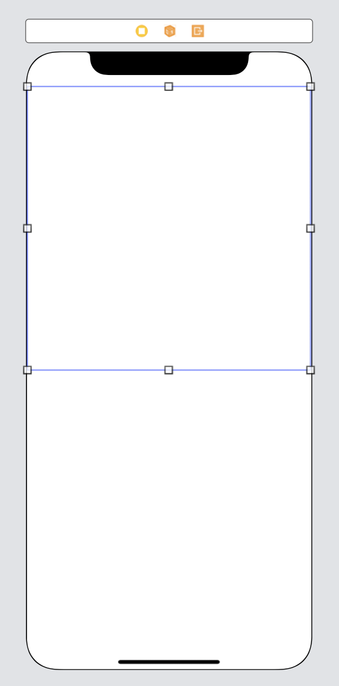
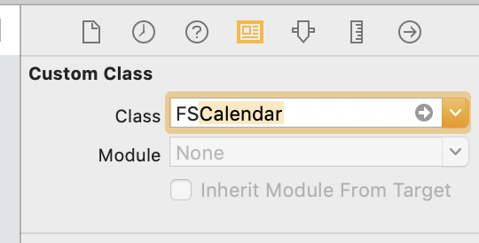

## 🗓 Calendar 
- [FSCalendar](https://github.com/WenchaoD/FSCalendar) 라이브러리 사용 

---

### 설치 방법
```
pod 'FSCalendar'
pod install 
```

---

### 사용하기
1️⃣ UIView 생성



2️⃣ View Class name 을 ```FSCalendar``` 으로 입력 -> 자동으로 바뀜


