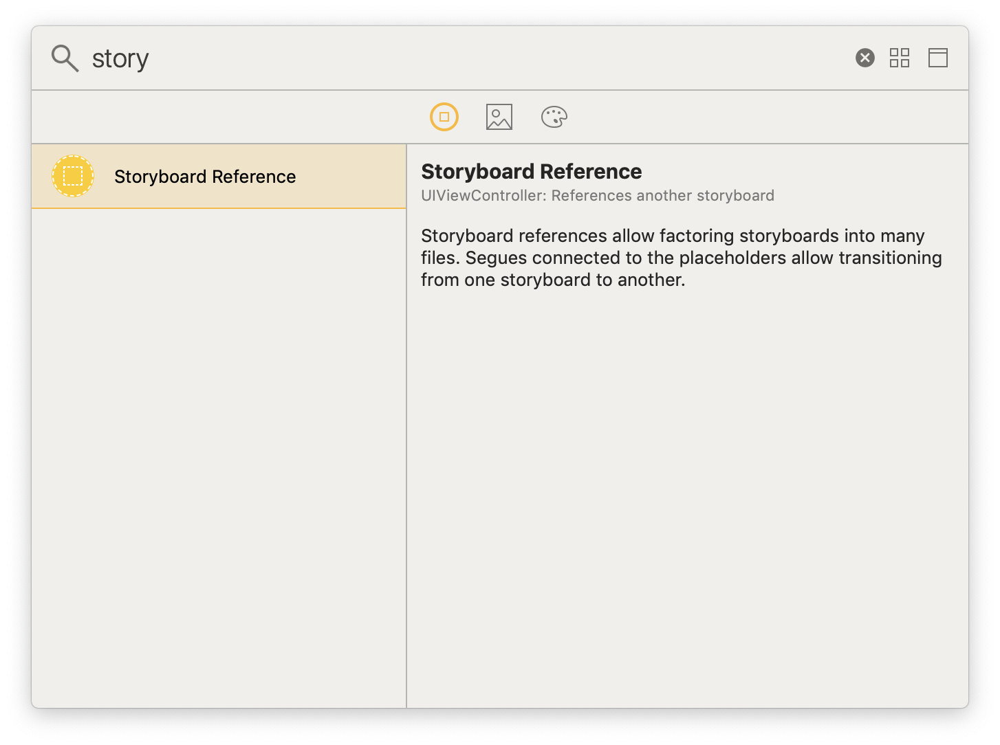
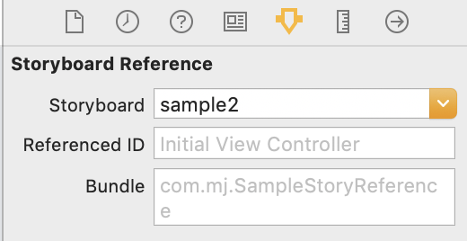
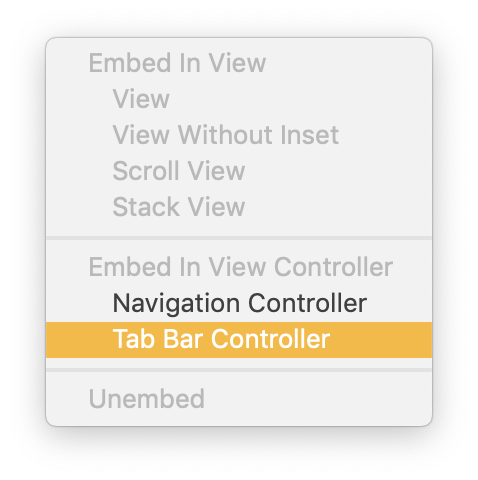
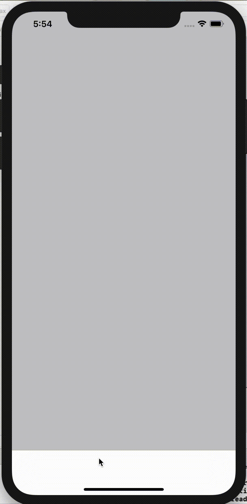

## Tabbar using Storyboard Reference 

- 한 storyboard 안에 여러 개 tabbar 를 넣으면 너무 복잡해지므로 storyboard reference 를 사용해 깔끔하게 분리해보자

1. Storyboard Reference 추가   

 

2. 미리 만들어 둔 원하는 storyboard ID 입력   

 

3. 원하는 storyboard reference 를 선택한 후 Tab Bar Controller 선택

 

4. 확인

