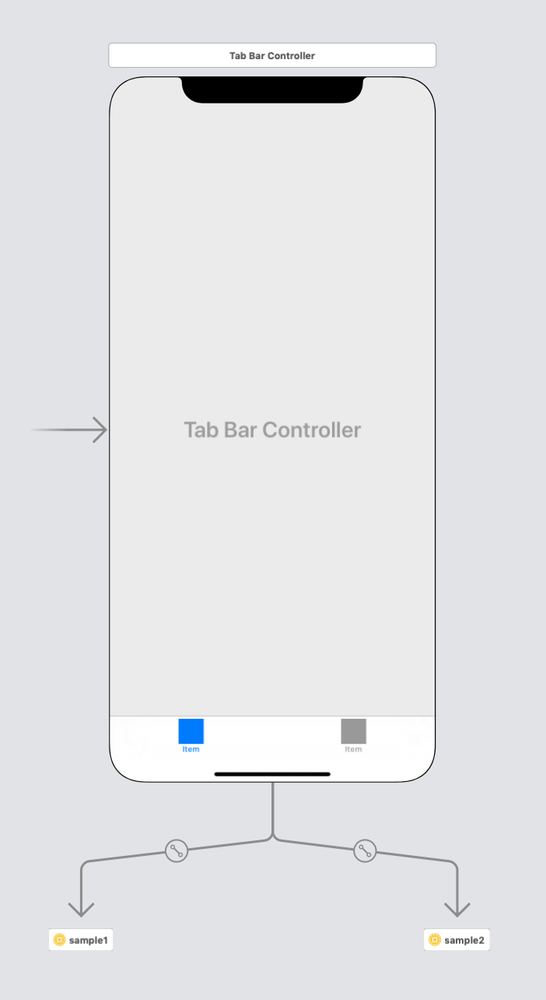
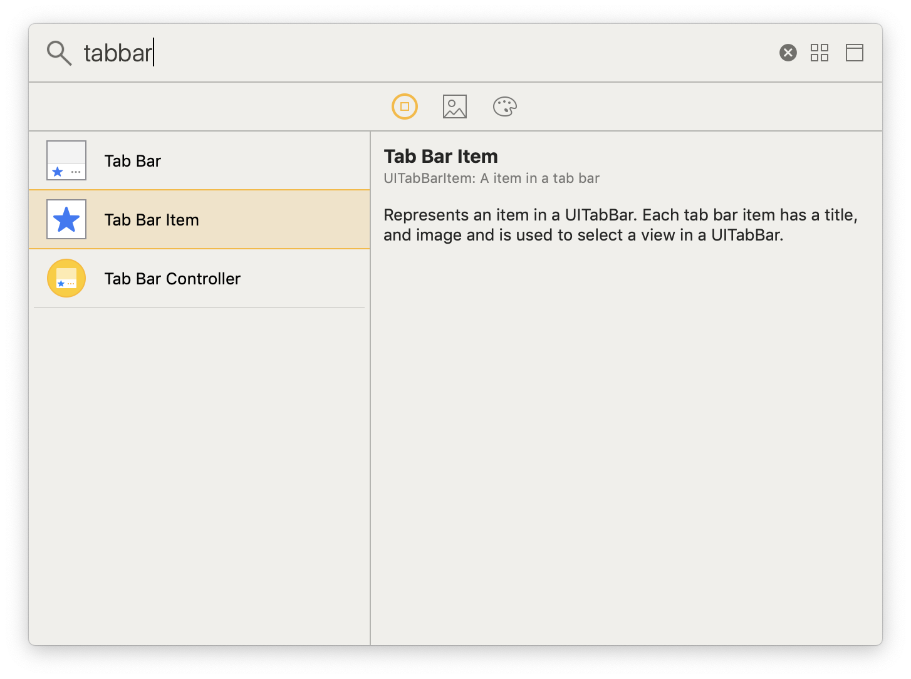
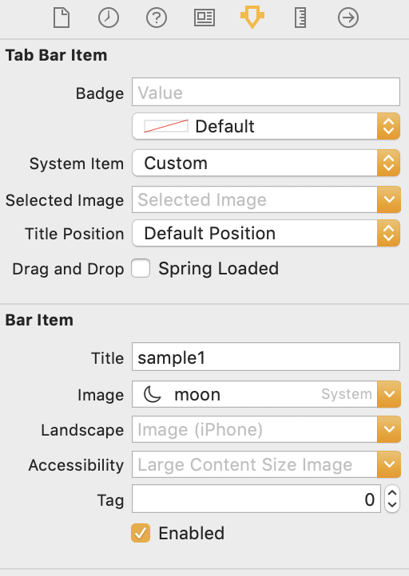
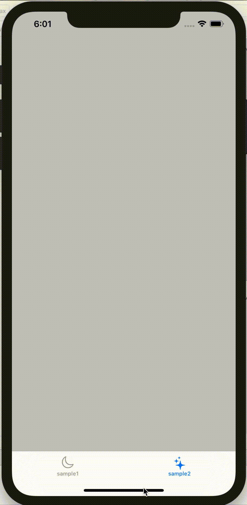

## Tabbar using Storyboard Reference 

- 한 storyboard 안에 여러 개 tabbar 를 넣으면 너무 복잡해지므로 storyboard reference 를 사용해 깔끔하게 분리해보자 ❗️

 

1. Storyboard Reference 추가   
 

 

2. 미리 만들어 둔 원하는 storyboard ID 입력   
 

 

3. 원하는 storyboard reference 를 선택한 후 Tab Bar Controller 선택

  

 

4. 확인

 

 

---

 

### 공백인 tabbar 에 원하는 title 과 image 를 넣어보자

 

1. 참조한 storyboard 의 viewcontroller 에 tabbar item 추가   

 

 

2. tabbar item 클릭 후 원하는 title 과 image 설정

 

 

3. 확인

 

