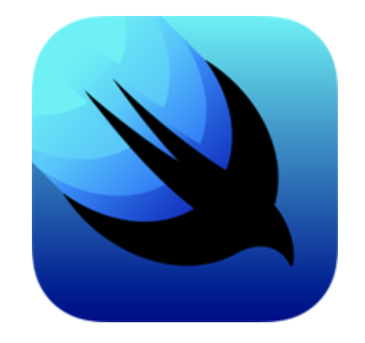
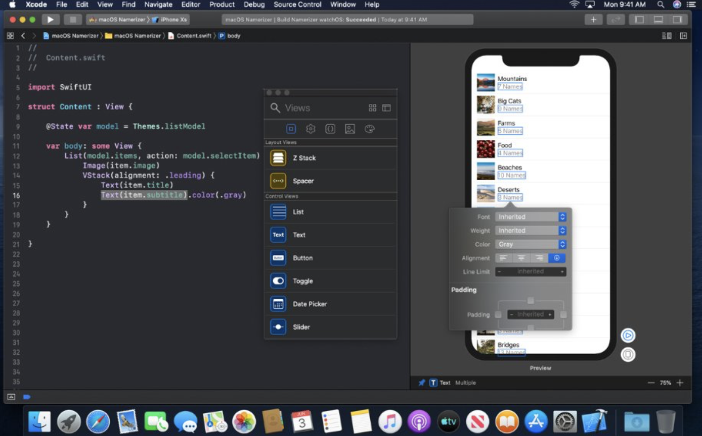
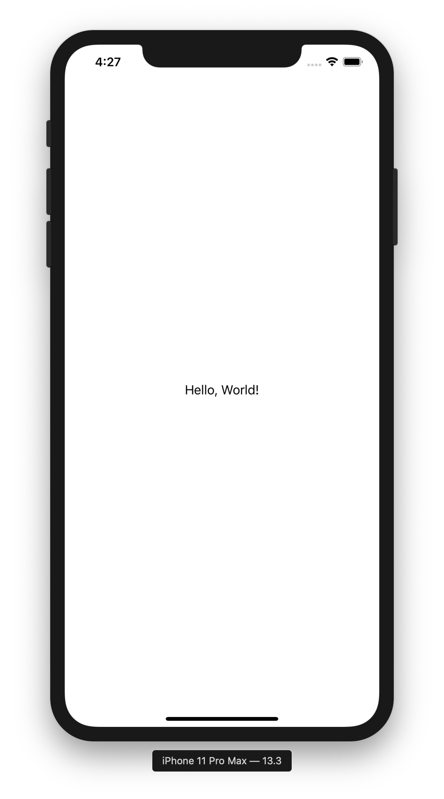
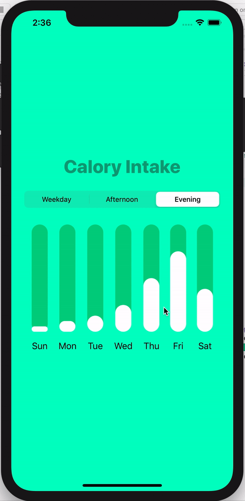

## Animated BarChart Using SwiftUI


### SwiftUI 란?
> SwiftUI는 모든 애플 플랫폼에서 사용자 인터페이스를 만들 수 있게 해주는 새로운 개발 패러다임이다.   
하나의 도구 및 API로 모든 애플 기기의 사용자 인터페이스를 만들 수 있게 해준다.




- 어떻게 레이아웃이 보이고 작동하는지에 대한 새로운 UI
- 실시간으로 Swift 코드 작성 시 UI 미리보기를 제공함
- UI 변수 연결인 outlets, action 을 컴파일 할 때 체크하여 런타임 때 UIFail 의 위험을 감소시킴
- 속도가 매우 빠름 
- 최신 버전의 운영체제에서만 작동 가능함 (macOS Catalina 10.15 beta, Xode 11 beta)

<br/>

### 첫 실행

```swift
import SwiftUI

struct ContentView: View {
    var body: some View {
        Text("Hello, World!")
    }
}

struct ContentView_Previews: PreviewProvider {
    static var previews: some View {
        ContentView()
    }
}
```



- swiftUI 에서 View는 반드시 **body** 변수가 있어야 하며 최상위 View 역할을 한다.
- ``` ContentView_Previews ``` 는 실제 앱에는 적용되지 않지만 Xcode 의 Canvas 기능을 위한 **Preview Layout** 이다.
- ``` State ``` 어노테이션이 붙은 변수에 변경이 일어나면 자동으로 View 를 다시 렌더링 한다.

<br/>

### Stack
- Vstack : 수직(Vertical) 으로 View 를 쌓음
- Hstack : 수평(Horizontal) 으로 View 를 쌓음
- ZStack : View 를 겹쳐서 쌓아 올림

<br/>

 


[swiftUI tutorial](https://www.youtube.com/watch?v=5lSJzzI2fj8)
- [공식 tutorial](https://developer.apple.com/tutorials/swiftui/creating-and-combining-views)
