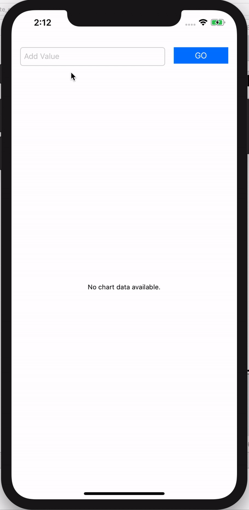

## create LineChart 📈

chart를 swift로 구현해보자!   

### Pod Install

유용한 [Chart Library](https://github.com/danielgindi/Charts) 를 사용하자

```sh
pod init

pod 'Charts'
pod install
```

### Add View for charts


UIView 를 추가한 다음 class 이름을 ```LineChartView``` 로 바꾼다.

### Coding

```swift
import Charts
```
charts 를 import 시켜준다.

```swift
var numbers: [Double] = []
```

numbers 는 chart 를 그릴 data들의 배열이다. double 형으로 선언해 주었다.

```swift
     var lineChartEntry = [ChartDataEntry]() // graph 에 보여줄 data array
        
     // chart data array 에 데이터 추가
     for i in 0..<numbers.count {
            let value = ChartDataEntry(x: Double(i), y: numbers[i])
            lineChartEntry.append(value)
     }
```

```lineChartEntry``` 는 그래프에 넣을 데이터배열이다.    
for문을 돌며 ```numbers``` 배열에 x,y value 를 추가해 append 해준다.
        
```swift
     let line1 = LineChartDataSet(entries: lineChartEntry, label: "Number")
     line1.colors = [NSUIColor.blue]
        
     let data = LineChartData()
     data.addDataSet(line1)
        
     lineChartView.data = data
```

그래프에 그릴 데이터의 이름과 색깔을 지정해준 후 linechart에 데이터를 추가한다.



