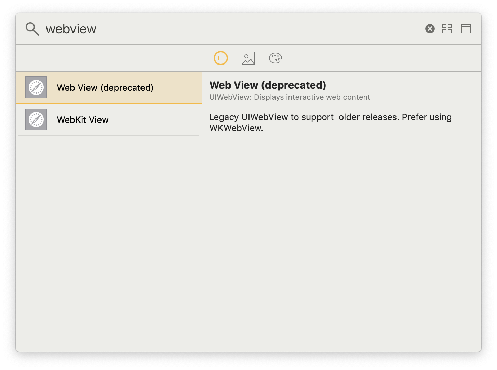
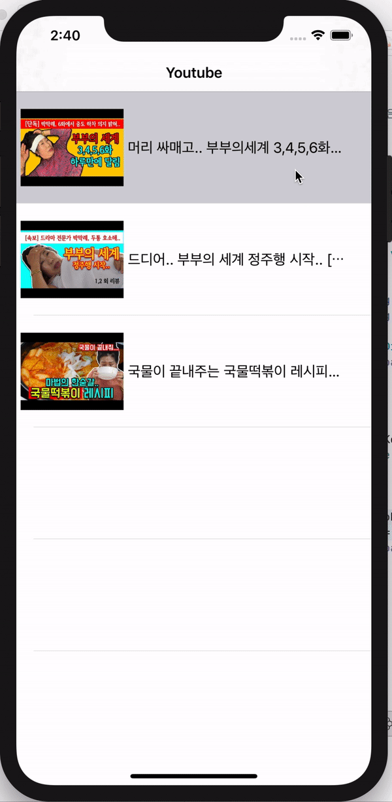

# Youtube Player 

### Video Class

```swift
class Video {
    var Key:String = ""
    var Title:String = ""
}
```


유튜브 영상 링크에서 영상의 key값을 불러올 수 있다. 

```swift
        var videos:[Video] = []
```

```swift
        let video1 = Video()
        video1.Key = "Cm84D_sFxHs"
        video1.Title = "머리 싸매고.. 부부의세계 3,4,5,6화 리뷰 [박막례 할머니]"
        videos.append(video1)
        
        let video2 = Video()
        video2.Key = "aGXq_CkBvOw"
        video2.Title = "드디어.. 부부의 세계 정주행 시작.. [박막례 할머니]"
        videos.append(video2)
        
        let video3 = Video()
        video3.Key = "5EdieXc3rnQ"
        video3.Title = "국물이 끝내주는 국물떡볶이 레시피 [박막례 할머니]"
        videos.append(video3)
```
원하는 영상의 ```Key```값과 ```title```을 가져와 ```videos``` 배열에 append 해 주었다.

<br/>

### Load Youtube Image

```
https://img.youtube.com/vi/[videoKey]/0.jpg
```

videoKey 만 있으면 위 주소로 영상 썸네일 이미지 링크를 불러올 수 있다.

```swift

    func tableView(_ tableView: UITableView, cellForRowAt indexPath: IndexPath) -> UITableViewCell {
        
        ...
        
        let urlString = "https://img.youtube.com/vi/\(videos[indexPath.row].Key)/0.jpg"
        let fileURL = URL(string: urlString)
        cell.videoImage.kf.setImage(with: fileURL)
        
        ...
    }
```

kingfisher 라이브러리를 사용해 url주소로 썸네일 이미지를 load 했다.

<br/>

### Load Youtube Video



ViewController 에 webView 를 추가한다.

```
https://www.youtube.com/embed/[videoKey]
```

위 주소에 원하는 videoKey 를 넣으면 영상을 불러올 수 있다.

```swift
    @IBOutlet weak var videoWebView: UIWebView!
    
    ...

    func getVideo(videoKey:String){
        guard let url = URL(string: "https://www.youtube.com/embed/\(videoKey)") else { return  }
        videoWebView.loadRequest(URLRequest(url: url))
    }
```

getVideo 함수를 사용해 유튜브 영상을 불러온다

<br/>

### 실행 화면


