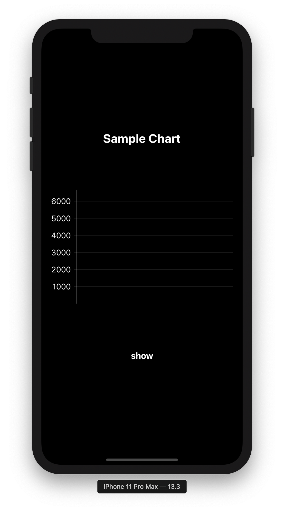
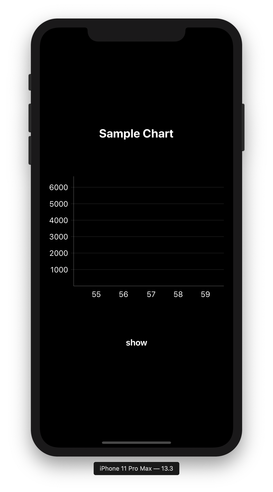
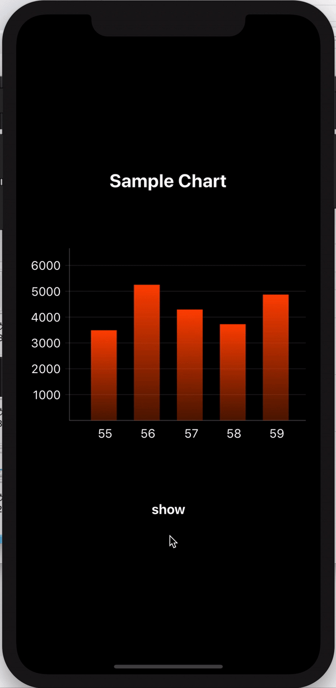

# Animated Chart

> 사용 라이브러리 : [Macaw](https://github.com/exyte/Macaw)

```sh
pod "Macaw", "0,9,6"
```
### 1. Create Bar Struct

```swift
import Foundation

struct SwiftNewsVideo {
    var showNumber: String
    var viewCount: Double
}
```
chart 에 그릴 정보를 담는 struct 이다. bar의 이름과 수치를 저장한다.

<br/>

### 2. Create MacawChartView

```swift

import Foundation
import Macaw

class MacawChartView: MacawView {
    
    required init?(coder aDecoder: NSCoder){
        super.init(node: MacawChartView.createChart(), coder: aDecoder)
    }
    
    private static func createChart() -> Group { // group : array of nodes

        return Group()
    }
    
    private static func addYAxisItems() -> [Node]{
        
        return []
    }
    
    private static func addXAxisItems() -> [Node]{
        
        return []
    }
    
    private static func createBars() -> Group {
        
        return Group
    }
}
```

chart를 보여줄 `MacawChartView` 를 만든다.   

- `createChart` : 전체적인 chart view 를 만든다.
- `addYAxisItems` : 높이를 표시하는 height line 를 그린다.
- `addXAxisItems` : x축을 따라 item label을 표시한다.

<br/>

### 3. Dummy data

```swift

static let lastFiveShows = createDummyData()

...

    private static func createDummyData() -> [SwiftNewsVideo] {
       let one = SwiftNewsVideo(showNumber: "55", viewCount: 3456)
       let two = SwiftNewsVideo(showNumber: "56", viewCount: 5200)
       let three = SwiftNewsVideo(showNumber: "57", viewCount: 4250)
       let four = SwiftNewsVideo(showNumber: "58", viewCount: 3688)
       let five = SwiftNewsVideo(showNumber: "59", viewCount: 4823)
       
       return [one, two, three, four, five]
   }

```
chart 에 그릴 dummy data를 생성해 `lastFiveShows` 에 저장했다.

<br/>

### 4. Set Value

```swift
    static let maxValue = 6000
    static let maxValueLineHeight = 180
    static let lineWidth: Double = 275

    static let dataDivisor = Double(maxValue/maxValueLineHeight) // 33.3333
    static let adjustedData: [Double] = lastFiveShows.map({ $0.viewCount / dataDivisor }) // $0 : each item
    static var animations: [Animation] = []
```
- `max value` : bar 의 최대 수치
- `maxValueHeight` : bar 의 최대 높이
- `adjustedData` : 각 item의 value값을 `maxValueHeight` 에 맞게 조정한 수치
- `animations` : animation 배열

<br/>

### 5. Add Functions

5-1. createChart

```swift
    private static func createChart() -> Group { // group : array of nodes
        var items:[Node] = addYAxisItems() + addXAxisItems()
        items.append(createBars())
        
        return Group(contents: items, place: .identity)
    }
```

`addYAxisItems`, `addXAxisItems`, `createBars` 를 통해 그래프를 그린다.   

5-2. addYAxisItem

```swift
    private static func addYAxisItems() -> [Node]{
        let maxLines = 6 // line 갯수
        let lineInterval = Int(maxValue/maxLines) // 6000/6 : 1000
        let yAxisHeight: Double = 200 // 전체 높이
        let lineSpacing: Double = 30
        
        var newNodes: [Node] = []
        
        for i in 1...maxLines { // 1~6
            let y = yAxisHeight - (Double(i) * lineSpacing) // 선을 그릴 높이
            let valueLine = Line(x1: -5, y1: y, x2: lineWidth, y2: y).stroke(fill: Color.white.with(a: 0.10))
            let valueText = Text(text: "\(i * lineInterval)", align: .max, baseline: .mid, place: .move(dx: -10, dy: y))
            valueText.fill = Color.white
            
            newNodes.append(valueLine)
            newNodes.append(valueText)
        }
        
        let yAxis = Line(x1: 0, y1: 0, x2: 0, y2: yAxisHeight).stroke(fill: Color.white.with(a: 0.25)) // y축
        newNodes.append(yAxis)
        
        return newNodes
    }
```


5-3. addXAxisItems

```swift
    private static func addXAxisItems() -> [Node]{
        let chartBaseY: Double = 200
        var newNodes: [Node] = []
        
        for i in 1...adjustedData.count { // 1~6
            let x = (Double(i) * 50) // start
            let valueText = Text(text: lastFiveShows[i-1].showNumber, align: .max, baseline: .mid, place: .move(dx: x, dy: chartBaseY + 15))
            valueText.fill = Color.white
            newNodes.append(valueText)
        }
        
        let xAxis = Line(x1: 0, y1: chartBaseY, x2: lineWidth, y2: chartBaseY).stroke(fill: Color.white.with(a: 0.25)) // x
        newNodes.append(xAxis)
        
        return newNodes
    }
```



5-4. createBars

```swift
    private static func createBars() -> Group {
        
        let fill = LinearGradient(degree: 90, from: Color(val: 0xff4704), to: Color(val: 0xff4704).with(a: 0.33))
        let items = adjustedData.map { _ in Group() }
        
        // each bar animations
        animations = items.enumerated().map { (i:Int, item:Group) in // i : index
            item.contentsVar.animation(delay: Double(i)*0.1) { t in // animation : left to right
                let height = adjustedData[i]*t
                let rect = Rect(x: Double(i)*50+25, y: 200-height, w: 30, h: height)
                return [rect.fill(with: fill)]
            }
        }
        
        return items.group()
    }
```
5-5. animation trigger

```swift
    static func playAnimations(){ // not private (animation trigger)
        animations.combine().play()
    }
```

```swift
    @IBAction func showChartButtonTapped(_ sender: UIButton) {
        MacawChartView.playAnimations()
    }
```


