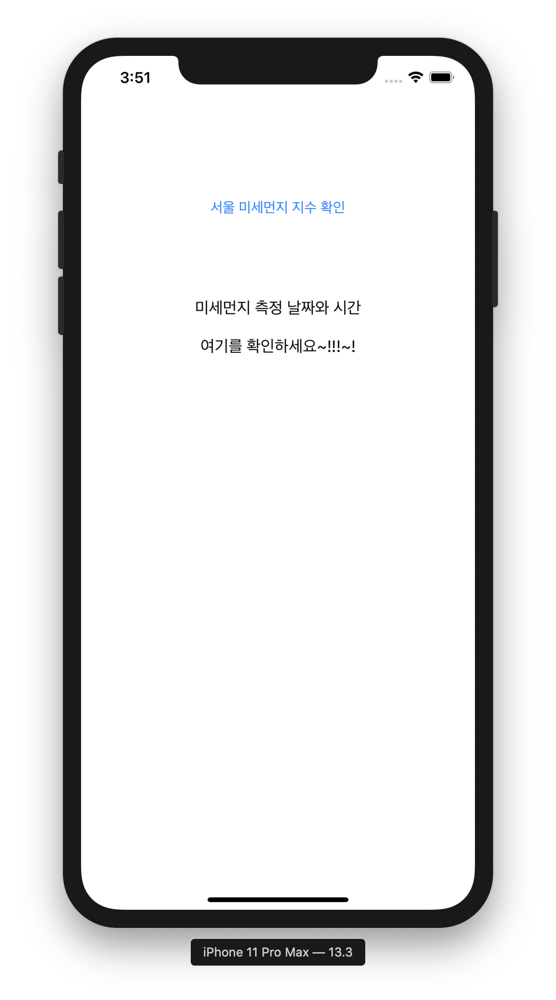
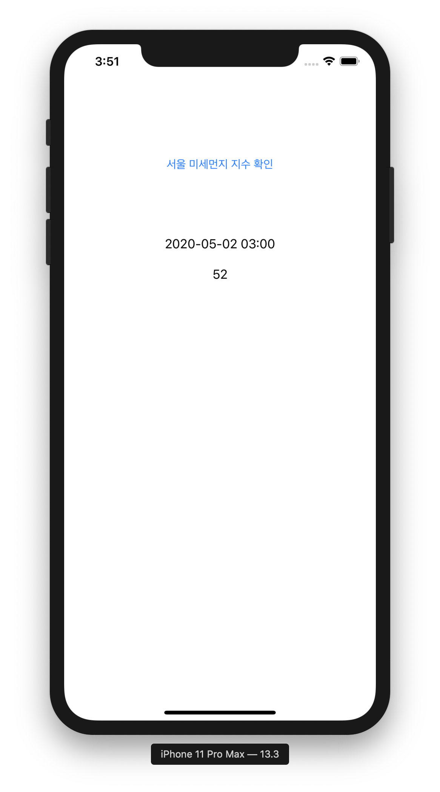

# 라이브러리 없이 API 연결하기

> 선수환경 : [한국 환경 공단 대기 오염 정보](https://www.data.go.kr/dataset/15000581/openapi.do) 사이트에서 API KEY 발급받기 (승인까지 1시간 소요)

라이브러리 사용 없이 외부 API 와 연결해 보자 ❗️    

위 API 에서 시도별 미세먼지 측정 정보를 조회할 것이다.

## 1. Setting Info.plist

기본 설정은 전송 보안이 안전하지 않기 때문에 일반 텍스트 HTTP 리소스 로드를 차단한다.   
따라서 `info.plist` 의 `<dict>` 안에 아래 코드를 추가한다.

```swift
    <key>NSAppTransportSecurity</key>
    <dict>
      <key>NSAllowsArbitraryLoads</key>
      <true/>
    </dict>
```

위 코드는 HTTP 모드를 활성화 해준다.   

<br/>

## 2. Encode URL

```
http://openapi.airkorea.or.kr/openapi/services/rest/ArpltnInforInqireSvc/getCtprvnRltmMesureDnsty?sidoName=서울&pageNo=1&numOfRows=10&ServiceKey=[발급받은 API KEY]&_returnType=json
```

호출해야 하는 URL 에 한글이 있을 경우 반드시 encode 를 해야 한다.   
전체 URL을 encode 하면 에러가 발생한다. url 주소는 이미 한 번 encode 되어 있는 상태이기 때문이다.


```swift
    func makeStringKoreanEncoded(_ string: String) -> String {
        return string.addingPercentEncoding(withAllowedCharacters: .urlFragmentAllowed) ?? string
    }
```

```swift
    let region = "서울"
    let encodeRegion = makeStringKoreanEncoded(region)
    let encodeURL = urlString + encodeRegion + urlString2
    let url = URL(string: encodeURL)!
```

따라서 위와 같이 한글인 부분만 encode를 해준다.

<br/>

## 3. Response Struct

위 API 를 호출하면 리턴되는 json 구조가 (좀 많이) 복잡하다...❗️    

```json
{
    "list": [
        {
            "_returnType": "json",
            "coGrade": "1",
            "coValue": "0.2",
            "dataTerm": "",
            "dataTime": "2020-05-02 02:00",
            "khaiGrade": "2",
            "khaiValue": "79",
            "mangName": "도시대기",
            "no2Grade": "1",
            "no2Value": "0.008",
            "numOfRows": "10",
            "o3Grade": "2",
            "o3Value": "0.054",
            "pageNo": "1",
            "pm10Grade": "2",
            "pm10Grade1h": "2",
            "pm10Value": "50",
            "pm10Value24": "48",
            "pm25Grade": "2",
            "pm25Grade1h": "2",
            "pm25Value": "33",
            "pm25Value24": "27",
            "resultCode": "",
            "resultMsg": "",
            "rnum": 0,
            "serviceKey": "",
            "sidoName": "",
            "so2Grade": "1",
            "so2Value": "0.002",
            "stationCode": "",
            "stationName": "영등포구",
            "totalCount": "",
            "ver": ""
        },
        ... (생략)
    ],
    ...(생략)
    },
    "totalCount": 40
}
```

리턴 값이 많이 복잡하고 빈 값도 많이 리턴한다.
구조를 만들 때 initializer 를 붙여주고 optional을 붙여주어야 한다. (안하면 오류남)   

```swift
struct AqiResponseString: Codable {
    let list: [ArpltnInforInqireSVCVo]?
    let parm, arpltnInforInqireSVCVo: ArpltnInforInqireSVCVo?
    let totalCount: Int?

    enum CodingKeys: String, CodingKey {
        case list, parm
        case arpltnInforInqireSVCVo
        case totalCount
    }
}

extension AqiResponseString {
    ...
}

struct ArpltnInforInqireSVCVo: Codable {
    ...
}

extension ArpltnInforInqireSVCVo {
    ..
}
```

> [이 사이트](https://app.quicktype.io/) 를 많이 참고해 만들었다.

일부 enum 값을 String 으로 모두 변환해주었다. (그대로 쓸 수 없었다)    
생각보다 까다롭고 복잡해서 여기에 시간을 가장 많이 쏟았다 ,, 아무튼 좋은 API 는 아닌 것 같다

<br/>

## 4. Connect to API

API 와 연결할 준비를 모두 마쳤으니 이제 연결해보자

```swift
    do {
            let responseString = try String(contentsOf: url)
            guard let data = responseString.data(using: .utf8) else { return }
            
            do {
                ..
            } catch (let err) {
                ..
            }
  
        } catch let e as NSError {
            print(e.localizedDescription)
        }
```

의외로 연결 코드는 간단하다.    
먼저 `string` 형태로 리턴값을 저장한 후 `utf8` 로 인코딩 시켜준다.

```
            do {
                let decoder = JSONDecoder()

                let object = try decoder.decode(AqiResponseString.self, from: data)
                
            } catch (let err) {
                print(err.localizedDescription)
            }
```

그리고 다시 JSONDecoder로 decode 해준다.

```swift
var aqiDataSet = [AqiResponseString]()
```

```swift
    self.aqiDataSet = [object] as! [AqiResponseString]

    self.misaeLabel.text = self.aqiDataSet[0].list![0].pm25Value
    self.dateLabel.text = self.aqiDataSet[0].list![0].dataTime
```

decode 한 데이터를 배열 `aqiDataSet` 에 넣어준 후 원하는 값을 가져온다.   

연결 성공 ‼️

<br/>

### 실행 화면

 
