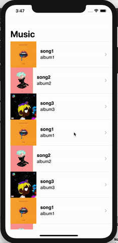

# Music Player

music player 를 만들어보자❗️

> 선수 환경 : 샘플 앨범 커버 이미지, 오디오 파일(mp3 형식) asset 에 저장해두기

1.  Song struct 

```swift
struct Song {
    let name: String
    let albumName: String
    let artitstName: String
    let imageName: String // 앨범 커버 img 이름
    let trackName: String // mp3 파일 이름
}
```
`song` 구조체를 선언해준다.

<br/>

2. present palyerVC

```swift
func tableView(_ tableView: UITableView, didSelectRowAt indexPath: IndexPath) {
    tableView.deselectRow(at: indexPath, animated: true)
    
    let position = indexPath.row
    guard let vc = storyboard?.instantiateViewController(identifier: "player") as? PlayerViewController else { return }
     
    vc.songs = songs
    vc.position = position
    
    present(vc, animated: true)
}
```

곡 목록에서 재생화면으로 넘어갈 때 전체 `song` 배열과 `position` 을 전달한다.

<br/>

3. Settting Player

```swift
import AVFoundation
```
필요한 패키지를 임포트 한다.

```swift
    var player: AVAudioPlayer?
```

음악을 재생시킬 `player` 변수를 전역으로 선언해준다.

```swift
    func configure(){

        let song = songs[position]

        let urlString  = Bundle.main.path(forResource: song.trackName, ofType: "mp3")

        do {
            try AVAudioSession.sharedInstance().setMode(.default )
            try AVAudioSession.sharedInstance().setActive(true, options: .notifyOthersOnDeactivation)
            
            guard let urlString = urlString else { return }
            
            player = try AVAudioPlayer(contentsOf: URL(string: urlString)!)
            guard let player = player else { return }
            player.volume = 0.5
            
            player.play()
            
        } catch {
            print("error" )
        } 
        
        ...
        
    }
```
화면을 불러올 때 음악을 자동으로 재생한다.

```swift
    override func viewWillDisappear(_ animated: Bool) {
         super.viewWillDisappear(animated)
         
         if let player = player {
             player.stop()
         }
     }
```
화면을 나갈 때 음악을 자동으로 재생을 멈춘다.   

이 외에 앨범 커버 이미지, 곡, 아티스트 라벨 설정은 생략 ㅎㅎㅎ `song` 객체에서 불러오면 된다.

<br/>

4. Setting play, pause button

```swift
    @objc func didTapPlayPauseButton(){
    if player?.isPlaying == true{
        player?.pause()
        playPauseButton.setBackgroundImage(UIImage(systemName: "play.fill"), for: .normal)
        
        // decrease image size
        UIView.animate(withDuration: 0.2, animations: {
            self.albumImageView.frame = CGRect(x: 30,
                                               y: 30,
                                               width: self.holder.frame.size.width-60,
                                               height: self.holder.frame.size.width-60)
            
        })
    } else {
        player?.play()
        playPauseButton.setBackgroundImage(UIImage(systemName: "pause.fill"), for: .normal)
        
        // increase image size
        UIView.animate(withDuration: 0.2, animations: {
            self.albumImageView.frame = CGRect(x: 10,
                                               y: 10,
                                               width: self.holder.frame.size.width-20,
                                               height: self.holder.frame.size.width-20)
            
        })
    }
```

플레이어가 현재 실행되는 중인 경우 플레이어를 pause 하고 play 이미지로 바꿔준다.   
반대로 플레이어가 현재 멈춘 상태인 경우 플레이어를 재생하고 pause 이미지로 바꾼다.    

플레이어가 pause 상태인 경우 이미지가 약간 축소되는 간단한 애니메이션을 넣어보았다.

<br/>

5. Setting volume

```swift
    slider.addTarget(self, action: #selector(didSlideSlider(_:)), for: .valueChanged)
```

```swift
    @objc func didSlideSlider(_ slider: UISlider){
        let value = slider.value
        player?.volume = value
    }
```

slider value 에 따라 플레이어 볼륨 크기를 조절한다.

<br/>

6. move to back / foward song

```swift
    @objc func didTapBackButton(){
        if position > 0 {
            position = position - 1
            player?.stop()
            for subview in holder.subviews {
                subview.removeFromSuperview()
            }
            configure()
        }
    }
```

이전 곡으로 넘어갈 때, `position > 0 ` 일 경우 (이전 곡이 존재하는 경우) 현재 곡 위치를 바꿔준 후 다시 뷰를 렌더링한다.

```swift
    @objc func didTapNextButton(){
        if position < (songs.count-1)  {
            position = position +  1
            player?.stop()
            for subview in holder.subviews {
                subview.removeFromSuperview()
            }
            configure()
        }
    }
```

다음 곡으로 넘어갈 때 `position < (songs.count-1)` 일 경우 (다음 곡이 존재하는 경우) 마찬가지로 현재 곡 위치를 바꿔준 후 다시 뷰를 렌더링한다.

<br/>

### Screenshot📱




