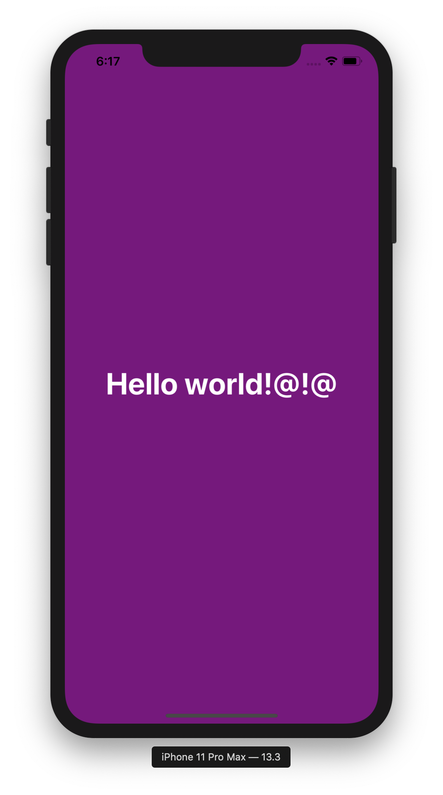
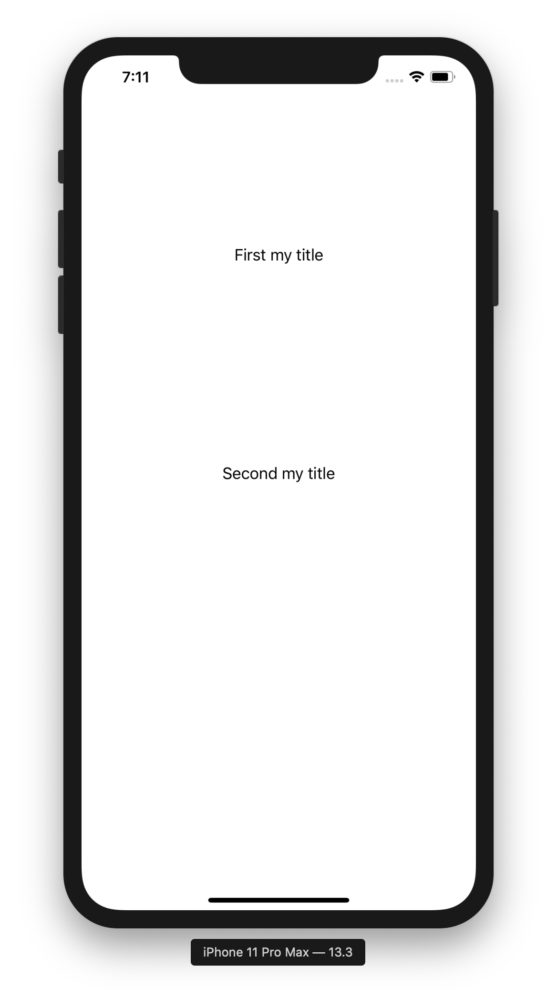

# Layout with XML

xml 과 연결해서 UI를 만들어보자❗️

> 사용 라이브러리 : [Layout](https://github.com/nicklockwood/layout)

### Pod install

```
pod 'Layout', '~> 0.6'
```

## AppDelegate

```swift
@UIApplicationMain
class AppDelegate: UIResponder, UIApplicationDelegate {
    var window: UIWindow?
    
    func application(_ application: UIApplication, didFinishLaunchingWithOptions launchOptions: [UIApplication.LaunchOptionsKey: Any]?) -> Bool {
        
        window = UIWindow()
        window?.rootViewController = ViewController()
        window?.makeKeyAndVisible()
        return true
    }
}
```

`rootview` 지정하기

## Load XML

```swift
import Layout

struct LayoutState{
    let isSelected: Bool
}
```

```swift

class ViewController: UIViewController, LayoutLoading {

    override func viewDidLoad() {
        super.viewDidLoad()

        loadLayout(
            named: "sample2.xml",
            state: LayoutState(isSelected: false),
            constants: [
                "title": "my title"
            ]
        )
    }

    // state 지정 
    func setSelected() {
        self.layoutNode?.setState(LayoutState(isSelected: true))
    }
}
```

- `named` : 불러올 xml 파일 이름
- `state`, `constants` : layout의 properties 지정 


## XML

```xml
<UIStackView
    alignment="center"
    axis="vertical"
    width="100%"
    height="50%"
    spacing="10">
    
    <UILabel text="First {title}"  />
    <UILabel text="Second {title}" />
    
</UIStackView>
```

```xml
<UIView
    backgroundColor="purple">
     
    <UILabel
        text="Hello world!@!@"
        textColor="white"
        center.y= "50%"
        center.x= "50%"
        font="40 bold"
        >
    </UILabel>
    
</UIView>

```

xml에서 지정할 수 있는 layout prperties 

```
top
left
bottom
right
leading
trailing
width
height
center.x
center.y
```

### screenshot

 

