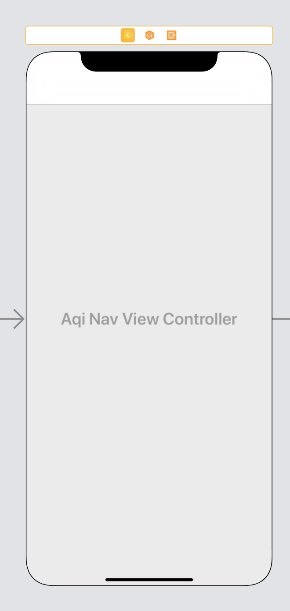
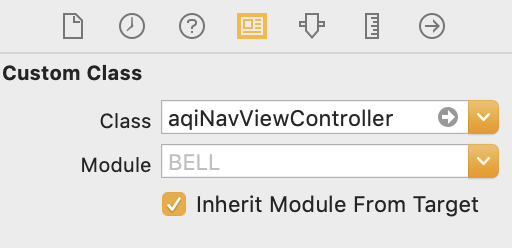

# Custom Navigation Bar

Navigation Bar 를 예쁘게 커스텀 해봅시당

## UIColor Extension

```swift
extension UIColor {
    convenience init(red: Int, green: Int, blue: Int) {
        assert(red >= 0 && red <= 255, "Invalid red component")
        assert(green >= 0 && green <= 255, "Invalid green component")
        assert(blue >= 0 && blue <= 255, "Invalid blue component")
        self.init(red: CGFloat(red) / 255.0, green: CGFloat(green) / 255.0, blue: CGFloat(blue) / 255.0, alpha: 1.0)
    }
    
    convenience init(rgb: Int) {
        self.init(
            red: (rgb >> 16) & 0xFF,
            green: (rgb >> 8) & 0xFF,
            blue: rgb & 0xFF
        )
    }
}
```

`Designated init` 과 `convinience init` 의 차이점   
- `Designated init` (지정 initializer) 은 이 클래스의 모든 프로퍼티가 초기화 되어야 한다.      
init 프로퍼티에서 클래스 프로퍼티가 하나라도 빠지게 된다면 오류가 발생한다. 
- `convinience init` 은 보조 initializer 이다. 

위 `UIColor Extension` 은 UIColor를 hexadecimal 하게 초기화 할 수 있도록 한다. 
> 예 : `UIColor(rgb: 0xFC4761)`

<br/>

## UIImage Extension

```swift
extension UIImage {
    // allows creating image from CALayer.
    class func image(from layer: CALayer) -> UIImage? {
        UIGraphicsBeginImageContextWithOptions(layer.bounds.size,
                                               layer.isOpaque, UIScreen.main.scale)
        defer { UIGraphicsEndImageContext() }
        // Don't proceed unless we have context
        guard let context = UIGraphicsGetCurrentContext() else {
            return nil
        }
        layer.render(in: context)
        return UIGraphicsGetImageFromCurrentImageContext()
    }
}
```

위 `UIImage Extension` 은 `CALayer` 에서 이미지를 만들 수 있도록 한다.    

CALayer 이란? 


실제로는 UIView에 속하며 실질적으로 뷰 위에 컨텐츠와 애니메이션을 그리는 행위를 담당한다.  그리고 가볍다!

<br/>

## UINavigationController

`UINavigationController.swift` 파일을 생성한 후 다음 함수를 작성한다.

1. Set variables

```swift
    let orangeGradient = [UIColor(rgb: 0xFC4761), UIColor(rgb: 0xFC5763), UIColor(rgb: 0xFD6C64), UIColor(rgb: 0xFD8667), UIColor(rgb: 0xFD9367)]
    let orangeGradientLocation = [0.0, 0.25, 0.5, 0.75, 1.0]
    lazy var colorView = { () -> UIView in
        let view = UIView()
        view.isUserInteractionEnabled = false
        navigationBar.addSubview(view)
        navigationBar.sendSubviewToBack(view)
        return view
    }()
```
2. configNavigationBar()

```swift
    func configNavigationBar() {
       navigationBar.barStyle = .default
       navigationBar.shadowImage = UIImage()
       navigationBar.isTranslucent = false
       navigationBar.prefersLargeTitles = true
       navigationItem.largeTitleDisplayMode = .always
       navigationBar.tintColor = UIColor.white
       navigationBar.largeTitleTextAttributes = [NSAttributedString.Key.foregroundColor: UIColor.white]
       navigationBar.titleTextAttributes = [NSAttributedString.Key.foregroundColor: UIColor.white]
       }
```

`navigationBar` 기본 상태를 설정해준다.


3. gradientImage()

```swift
    func gradientImage(withColours colours: [UIColor], location: [Double], view: UIView) -> UIImage {
        let gradient = CAGradientLayer()
        gradient.frame = view.bounds
        gradient.colors = colours.map { $0.cgColor }
        gradient.startPoint = (CGPoint(x: 0.0,y: 0.5), CGPoint(x: 1.0,y: 0.5)).0
        gradient.endPoint = (CGPoint(x: 0.0,y: 0.5), CGPoint(x: 1.0,y: 0.5)).1
        gradient.locations = location as [NSNumber]
        gradient.cornerRadius = view.layer.cornerRadius
        return UIImage.image(from: gradient) ?? UIImage()
    }
```

gradient image 를 만든다.  startPoint, endPoint 를 조절해서 gradient 방향을 조절할 수 있다.    
(지금은 수평 방향이다.)

4. changeGradientImage()
```swift
    func changeGradientImage() {
        // 1 status bar
        colorView.frame = CGRect(x: 0, y: -UIApplication.shared.statusBarFrame.height, width: navigationBar.frame.width, height: UIApplication.shared.statusBarFrame.height)
        
        // 2 setting color
        colorView.backgroundColor = UIColor(patternImage: gradientImage(withColours: orangeGradient, location: orangeGradientLocation, view: navigationBar).resizableImage(withCapInsets: UIEdgeInsets(top: 0, left: navigationBar.frame.size.width/2, bottom: 10, right: navigationBar.frame.size.width/2), resizingMode: .stretch))
        
        // 3 small title background
        navigationBar.setBackgroundImage(gradientImage(withColours: orangeGradient, location: orangeGradientLocation, view: navigationBar), for: .default)
        
        // 4 large title background
        navigationBar.layer.backgroundColor = UIColor(patternImage: gradientImage(withColours: orangeGradient, location: orangeGradientLocation, view: navigationBar).resizableImage(withCapInsets: UIEdgeInsets(top: 0, left: navigationBar.frame.size.width/2, bottom: 10, right: navigationBar.frame.size.width/2), resizingMode: .stretch)).cgColor
    }
```
gradientImage 를 navigation bar 에 적용한다.    

small title 일 경우, large title 일 경우 모두 처리한다.

5. ViewDidLoad()
```swift
    override func viewDidLoad() {
        super.viewDidLoad()
        
        configNavigationBar()
        changeGradientImage()
    }
```
`viewDidLoad` 에서 앞서 만든 두 함수를 호출한다.

<br/>

## Setting on Storyboard




navigation controller 를 누른 다음 우리가 작성한 `navigationViewController.swift` 파일을 세팅한다.

이제 실행시켜 확인해보자❗️

<br/>
 
### Screenshot 📱


