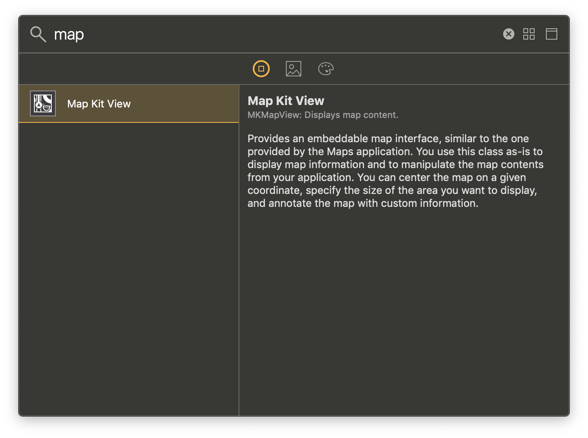
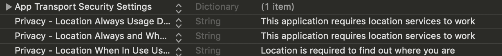
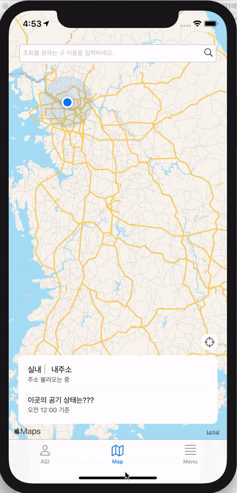
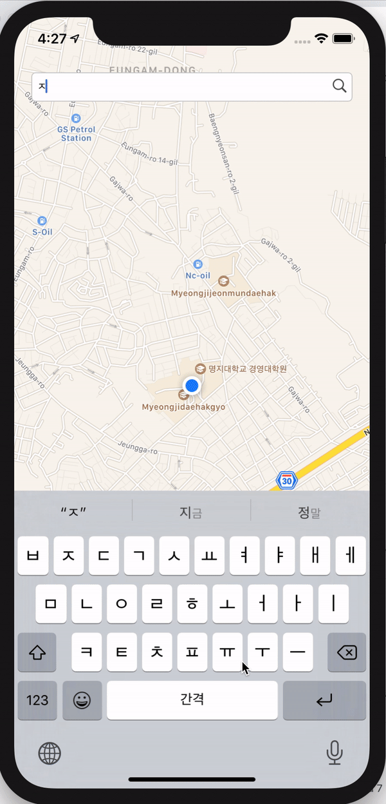

# Apple Map 사용하기 

지도 라이브러리로 google map, naver map 등등이 있지만, 이번 캡스톤 프로젝트는 라이브러리를 최대한❗️ 사용하지 않는 것이 목적이므로 기본 라이브러리인 MapKit 을 사용해 구현해 보았다.

MapVC 에서 구현할 기능은 크게 세 가지이다. 

1. 내 위치 지도에 찍기 
2. 주소 찾기
3. 내가 원하는 지역으로 지도 이동하기

이제 구현을 시작해보자!

<br/>

## Add Map Kit View



Storyboard에 위 Map Kit View 를 추가하기만 하면 놀랍게도 지도가 불러와진다.     

오토레이아웃이 제대로 잡혀있는지 확인하기 위해 여러 시뮬에서 돌려보았는데, Xcode가 실행중일 때는 전혀 오류가 안 나지만, Xcode 종료 후 어플을 실행하면 계속 앱이 죽는 현상이 발생했는데

```swift
    self.mapView.mapType = MKMapType.standard
```

ViewDidLoad 에서 이 코드를 추가하니 말끔히 문제가 해결되었다. 

<br/>

## Tracking my location

지도가 준비되었으니 이제 내 위치를 지도에 찍어보자.



Info.plist 에 `NSLocationWhenInUseUsageDescription` 이나 `NSLocationAlwaysUsageDescription` 을 추가한다. 

> 나는 계속 에러가 발생해서 이것저것 추가하느라 세 개를 다 추가했지만 사실 저 두 개중 하나만 추가해도 앱은 잘 돌아간다 .. 내 에러는 다른 문제였다.

```swift
import CoreLocation
```
```swift
    self.mapView.showsUserLocation = true
    self.mapView.setUserTrackingMode(.follow, animated: true)
```
ViewDidLoad 에 이 함수만 작성해주면 지도에 내 위치 표시가 가능 하지만,, 주소 불러오기, 위도, 경도값 불러오기, 확대 등등도 해야 하므로 다른 코드들도 작성해준다. 지도에 단순 위치 표시라면 여기까지만 코드를 작성해도 무방하다.

<br/>

```swift

    var locationManager: CLLocationManager = CLLocationManager() // location manager
    var currentLocation: CLLocation! // 내 위치 저장
    
    func locationManager(_ manager: CLLocationManager, didUpdateLocations locations: [CLLocation]) {
        locationManager = manager
        if CLLocationManager.authorizationStatus() == .authorizedWhenInUse {
            currentLocation = locationManager.location
        }
    }

    class MapViewController: UIViewController, CLLocationManagerDelegate, MKMapViewDelegate {

        locationManager.delegate = self
        locationManager.desiredAccuracy = kCLLocationAccuracyBest
        locationManager.requestWhenInUseAuthorization()
        locationManager.startUpdatingLocation()
        locationManager.startMonitoringSignificantLocationChanges()
        
        ...
    }
```
```swift
    self.currentLocation = locationManager.location
```

`CoreLocation` 을 import 해주고, `CLLocationManagerDelegate`, `MKMapViewDelegate` 을 적는다.     

location 을 관리할 `CLLocationManager`, 그리고 내 위치를 저장해줄 `currentLocation` 을 변수로 선언한다.      
이 외에 locatinManager 에 여러 옵션들을 지정해준다.

```swift
// MARK : 위치 받아오기 에러 처리
override func viewDidAppear(_ animated: Bool) {
    super.viewDidAppear(animated)
    
    if CLLocationManager.locationServicesEnabled() {
        if CLLocationManager.authorizationStatus() == .denied || CLLocationManager.authorizationStatus() == .restricted {
            let alert = UIAlertController(title: "오류 발생", message: "위치 서비스 기능이 꺼져있음", preferredStyle: .alert)
            let okAction = UIAlertAction(title: "OK", style: UIAlertAction.Style.default, handler: nil)
            alert.addAction(okAction)
            self.present(alert, animated: true, completion: nil)
        } else {
            locationManager.desiredAccuracy = kCLLocationAccuracyBest
            locationManager.delegate = self
            locationManager.requestWhenInUseAuthorization()
        }
    } else {
        let alert = UIAlertController(title: "오류 발생", message: "위치 서비스 제공 불가", preferredStyle: .alert)
        let okAction = UIAlertAction(title: "OK", style: UIAlertAction.Style.default, handler: nil)
        alert.addAction(okAction)
        self.present(alert, animated: true, completion: nil)
    }
}
```
위치를 받아올 때 에러가 발생하는 경우도 있으므로 에러 처리를 꼼꼼하게 해준다. 

<br/>

```swift
// MARK : 위치 허용 선택했을 때 처리
func locationManager(_ manager: CLLocationManager, didChangeAuthorization status: CLAuthorizationStatus) {
    switch status {
    case .notDetermined :
        manager.requestWhenInUseAuthorization()
        break
    case .authorizedWhenInUse:
        self.firstSetting()
        break
    case .authorizedAlways:
        self.firstSetting()
        break
    case .restricted :
        break
    case .denied :
        break
    default:
        break
    }
}
```
> 내 에러의 주범 ㅎㅎㅋㅎㅋ

바로 내 위치의 위도 경도 값을 받아올 때 자꾸 nil값이 오는 에러가 발생했는데, 위치 허용했을 때 처리를 제대로 해주지 않아서였다 .. (위치 허용 버튼을 누르기 전에는 위치값을 받아올 수 없어서 nil 값이 왔음)

`firstsetting` 함수는 

```swift
    self.currentLocation = locationManager.location
```
내 현재 위치를 locatioinManager.location 값을 저장하는 함수이다. 복잡해 보여서 그냥 밖으로 뺐다. 


 

코드를 모두 작성하면 이렇게 지도에 내 위치가 뜬다.

참고로 내 위치로 다시 돌아가고 싶으면

```swift
    self.mapView.showsUserLocation = true
    self.mapView.setUserTrackingMode(.follow, animated: true)
```
원하는 action 에 다시 이 함수를 작성하면 된다.

<br/>

## Find Address with Coordinate

`currentLocation` 에 저장된 위도, 경도 값으로 내 주소를 받아오자.

```swift
// MARK : 위도, 경도에 따른 주소 찾기
func findAddr(lat: CLLocationDegrees, long: CLLocationDegrees){
    let findLocation = CLLocation(latitude: lat, longitude: long)
    let geocoder = CLGeocoder()
    let locale = Locale(identifier: "Ko-kr")
    
    geocoder.reverseGeocodeLocation(findLocation, preferredLocale: locale, completionHandler: {(placemarks, error) in
        if let address: [CLPlacemark] = placemarks {
            var myAdd: String = ""
            if let area: String = address.last?.locality{
                myAdd += area
            }
            if let name: String = address.last?.name {
                myAdd += " "
                myAdd += name
            }
        }
    })
}
```

`locale` 에서 국가를 한국으로 지정하고, `geocoder` 로 주소를 읽어온다. 

`address.last?.` 의 뒤에 옵션으로 주소 범위를 지정할 수 있다. 원하는 범위대로 주소를 불러오자.

<br/>

## Move to Search Location

> 이동하기 원하는 주소의 위도, 경도 값이 있을 경우에 사용 가능.

```swift
    let dobongLoc = CLLocationCoordinate2D(latitude: 37.6658609, longitude: 127.0317674) // 도봉구
    let eunpyeongLoc = CLLocationCoordinate2D(latitude: 37.6176125, longitude: 126.9227004) // 은평구
    let dongdaemoonLoc = CLLocationCoordinate2D(latitude: 37.5838012, longitude: 127.0507003) // 동대문구
```

이동하기 원하는 지역의 위도,경도 값을 `CLLocationCoordinate2D` 에 저장해둔다.

```swift
// MARK : 검색한 위치로 이동 & marker 추가
func setMapView(coordinate: CLLocationCoordinate2D, addr: String){
    let region = MKCoordinateRegion(center: coordinate, span: MKCoordinateSpan(latitudeDelta:0.01, longitudeDelta:0.01))
    self.mapView.setRegion(region, animated: true)
    
    let annotation = MKPointAnnotation()
    annotation.coordinate = coordinate
    annotation.title = addr
    self.mapView.addAnnotation(annotation)
    
    self.findAddr(lat: coordinate.latitude, long: coordinate.longitude)
}
```
`MKCoordinateRegion` 으로 앞서 저장해둔 `CLLocationCoordinate2D` 값을 좌표에 지정하고, `setRegion` 으로 지도의 좌표를 이동시킨다. 

`MKPointAnnotation` 으로 원하는 곳에 mark를 찍을 수 있다.        
annotation 에는 title, animation 등 여러 옵션들을 지정할 수 있다. 원하는 옵션을 지정하자.




원하는 곳으로 이동하고 좌표 찍기까지 성공 !
