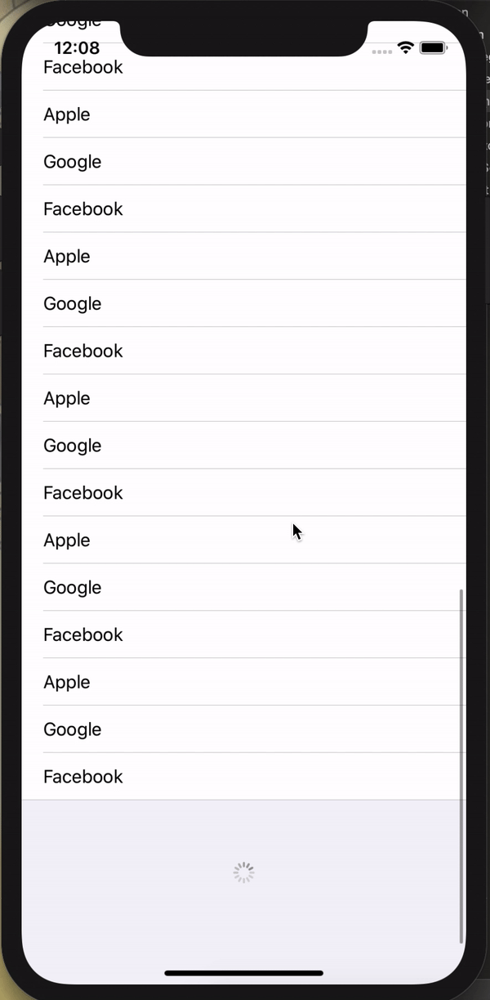

# Pagination

Infinite scroll 을 tableview 를 사용해 만들어보자~!

> 참고 영상 : [Infinite scroll & Pagination Tableview](https://www.youtube.com/watch?v=TxH35Iqw89A)


<br/>

## API Caller  

```swift
class APICaller {
    var isPaginating = false
    
    func fetchData(pagination:Bool = false, completion: @escaping (Result<[String], Error>) -> Void){
        
        if pagination {
            isPaginating = true
        }
        
        DispatchQueue.global().asyncAfter(deadline: .now() + (pagination ? 3 : 2) , execute: {
            let originalData = [
                "Apple",
                "Google", ...
            ]
            
            let newData = ["dam", "mbti","cute"] 
            
            completion(.success(pagination ? newData : originalData))
            
            if pagination {
                self.isPaginating = false
            }
        })
    }
}

```


> 지금 예시는 실제 API 와 연결하지 않아 샘플 데이터를 넣었다.


`isPaginating` 은 현재 지금 데이터가 로드 중인지 여부를 의미한다. 

`fetchdata` 에서 매개변수로 받는  `pagination` 이 true 면 `newData` 를, false 인 경우는 `originalData` 를 전달하도록 했다. 


<br/>


## ViewDidLayoutSubviews

```swift
	override func viewDidLayoutSubviews() {
        super.viewDidLayoutSubviews()
        
        tableView.frame = view.bounds
        apiCaller.fetchData(pagination: false, completion: { [weak self] result in
            switch result {
            case .success(let data):
                self?.data.append(contentsOf: data)
                DispatchQueue.main.async {
                    self?.tableView.reloadData()
                }
            case .failure(_):
                break
            }
        })
    }
```

`ViewDidLayoutSubviews()` 는  `ViewWillAppear()` 와 `ViewDidAppear()` 사이에 호출된다. (상황에 따라 반복적으로 호출 된다.) 자세한 설명은 [여기](https://oaksong.github.io/2018/03/02/layout-subviews/)


<details>
	<summary>레이아웃이 결정되는 과정</summary>

    <br/>
    
        1. ViewWillLayoutSubViews() 메소드를 호출한다.
        2. 뷰컨의 contentView 가 layoutSubviews() 를 호출한다. 
              - 이 메서드는 현재 레이아웃 정보들을 바탕으로 새로운 레이아웃 정보를 계산한다. 이후 뷰 계층구조를 순회하면서 모든 하위 뷰들이 동일한 메서드를 호출하게 한다.
        3. 레이아웃 정보의 변경 사항들을 뷰들에 반영한다. 
        4. ViewDidLayoutSubviews() 메소드를 호출한다. 
</details>


<br/>


## Spinner

```swift
    private func createSpinnerFooter() -> UIView {
        let footerView = UIView(frame: CGRect(x: 0, y: 0, width: view.frame.size.width, height: 100))
        
        let spinner = UIActivityIndicatorView()
        spinner.center = footerView.center
        footerView.addSubview(spinner)
        spinner.startAnimating()
        
        return footerView
    }
```


로딩창을 미리 만들어둔다.


<br/>


## scrollViewDidScroll

```swift
    func scrollViewDidScroll(_ scrollView: UIScrollView) {
        let position = scrollView.contentOffset.y
        
        if position > (tableView.contentSize.height - 100 - scrollView.frame.size.height) {
            
            guard !apiCaller.isPaginating else {
                // we are already fetching more data
                return
            }
            
            self.tableView.tableFooterView = createSpinnerFooter()
            
            // fetch more data
            apiCaller.fetchData(pagination: true){ [weak self] result in
                DispatchQueue.main.async {
                    self?.tableView.tableFooterView = nil
                }
                switch result {
                case .success(let moreData):
                    self?.data.append(contentsOf: moreData)
                    DispatchQueue.main.async {
                        self?.tableView.reloadData()
                    }
                case .failure(_):
                    break
                }
            }
            
        }
    }
```


`tableView.contentSize.height - scrollView.frame.size.height - 100` 인 경우 (아래로 스크롤을 했을 경우) 데이터를 불러온다. 

데이터를 불러오는 동안은 tableView footer 에 spinner 를 붙이고 로드가 끝나면 footer에 nil처리를 한다. 


### Screenshot



