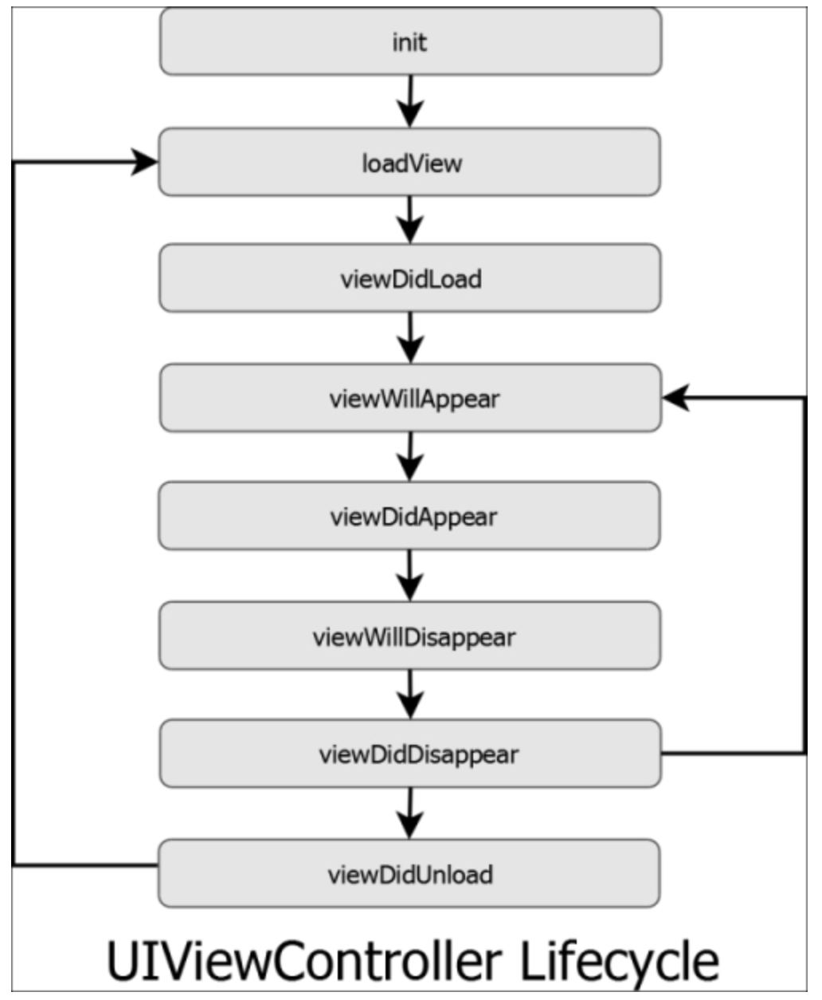

# ViewController Life Cycle

View Controller 에서는 생명주기는  화면에 보여졌다가 사라지는 주기를 말합니다.

### `loadView()`

화면에 띄워줄 view를 만드는 메소드로  view를 만들고 메모리에 올립니다.

애플 공식문서를 보면 사용자는 이 메소드를 직접 호출 하지 말라고 쓰여있습니다. 모두 직접적으로 코딩하여 만드는 경우를 제외하고서는 override하지 않는것이 좋다고 합니다.

 

###  `viewDidLoad()`

뷰의 컨트롤러가 메모리에 로드 된 후에 호출되며 시스템에 의해 자동으로 호출이 됩니다.  사용자에게 화면이 보여지기 전에 데이터를 뿌려주는 행위에 대한 코드를 작성할 수 있습니다.반적으로 리소스를 초기화하거나, 초기화면을 구성하는 용도로 주로 쓰입니다.

이 메소드는 View Controller 생에 **딱 한 번** 호출이 됩니다. 따라서 한 번만 있을 행위에 대해서는 이 메소드 안에 정의 해야 합니다.

 

### `viewWillAppear()`

뷰 컨트롤러의 화면이 올라오고 난후 뷰가 화면에 나타나기 직전에 호출이 됩니다. 즉 뷰가 로드 된 이후, 눈에 보이기 전에 컨트롤러에게 알리는 역할을 수행합니다. 

다른 뷰로 이동했다가 되돌아올때 재 호출되는 매소드로 화면이 나타날 때 마다 수행해야하는 작업을 정의하기 좋습니다.

> 처음 어플리케이션이 수행되고 첫 화면이 띄워질때 호출되는 것은 `viewDidLoad()`와 동일하지만, 화면 전환을 통해 다시 현재의 화면으로 돌아올 때 `viewDidLoad`가 아닌 `viewWillAppear`가 호출됩니다.

 

### `viewDidAppear()`

view가 데이터와 함께 완전히 화면에 나타난 후 호출되는 메소드입니다.

 

### `viewWillDisappear()`

다음 View Controller 화면이 전환하기 전이나 View Controller 가 사라지기 직전에 호출되는 메소드입니다.

 

### `viewDidDisappear()`

View Controller들이 화면에서 사라지고 나서 호출되는 메소드입니다. 화면이 사라지고 나서 필요없어지는 (멈춰야하는) 작업들을 여기서 할 수 있습니다. 

 

### ``

 
